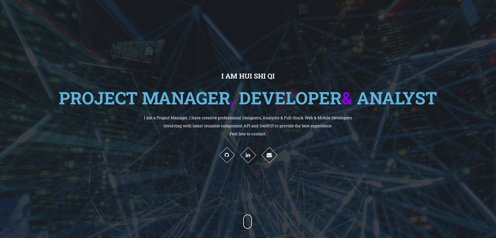

# I AM Hui Shi Qi
I AM Hui Shi Qi, Project Manager & Developer. My team has Full-Stack web & mobile developers, Database Analysts, designers and analysts. Learning at University of Canberra.

We are open to help you with your projects or consulting needs.
Feel free to reach out to me via <a href="https://www.linkedin.com/in/hui-shi-qi-403979128/" target="_blank">LinkedIn</a>.
Email: <b>softman009@outlook.com</b>
Skype: <b>live:.cid.172ad87683538af7</b>
Phone: <b>+1 786 837 5270</b>
WeChat: <b>jon199112</b>

Also browse my shop at <a href="https://furrycanva.com">FurryCanva</a>

## Demo
[link to Demo](https://nightsky108.github.io/):[https://nightsky108.github.io/](https://nightsky108.github.io/)

## Skills
- HTML
- HTML5
- CSS
- CSS3
- Bootstrap4
- Materialize CSS
- JavaScript
- JSON
- NPM
- Node.js
- React.js
- MySQL
- MongoDB
- Mongoose
- Express
- Sequelize
- Handlebars
- Arrays
- IF ELSE STATEMENTS
- LOOPS
- DE-BUGGING
- and MORE

#### Author
Hui Shi Qi
